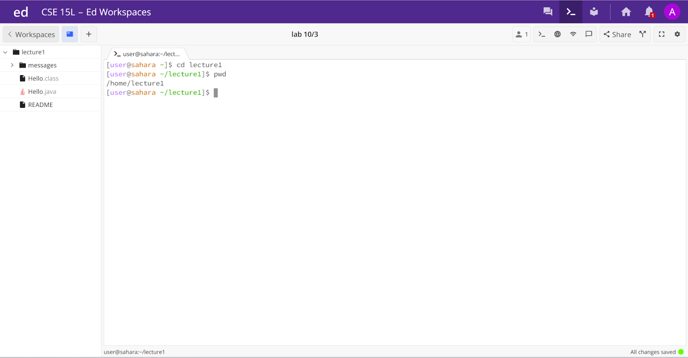
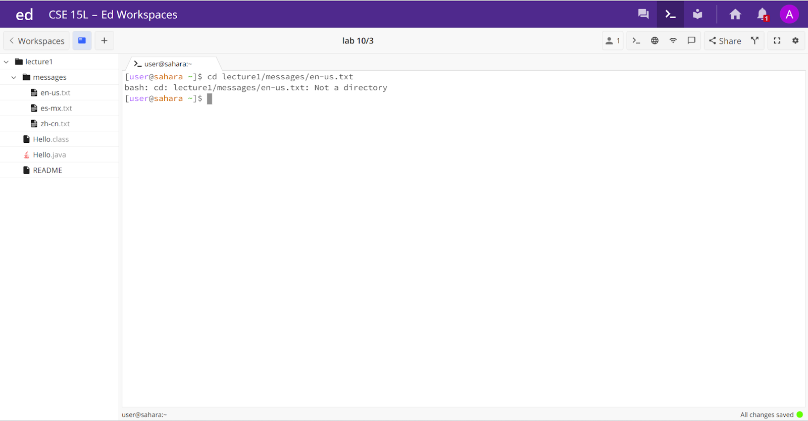
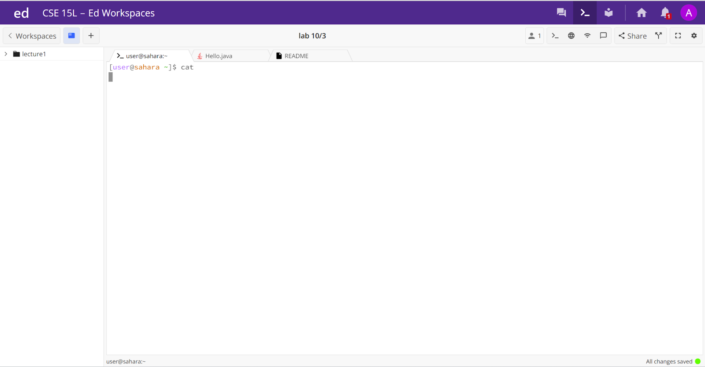
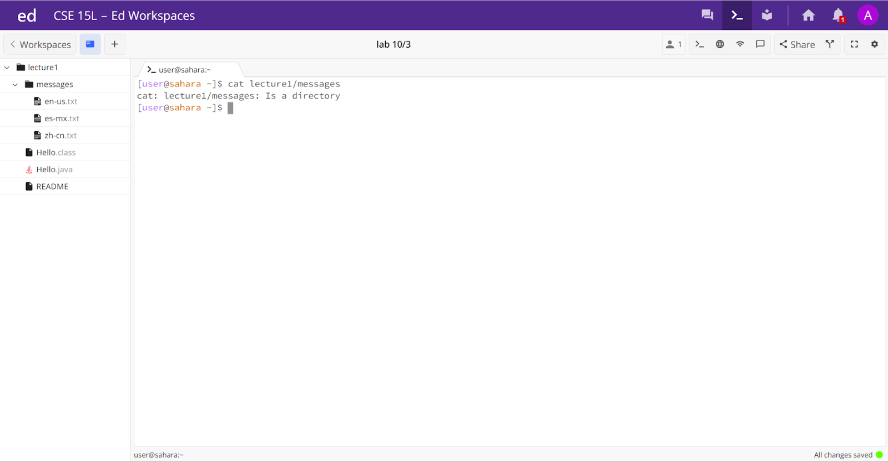
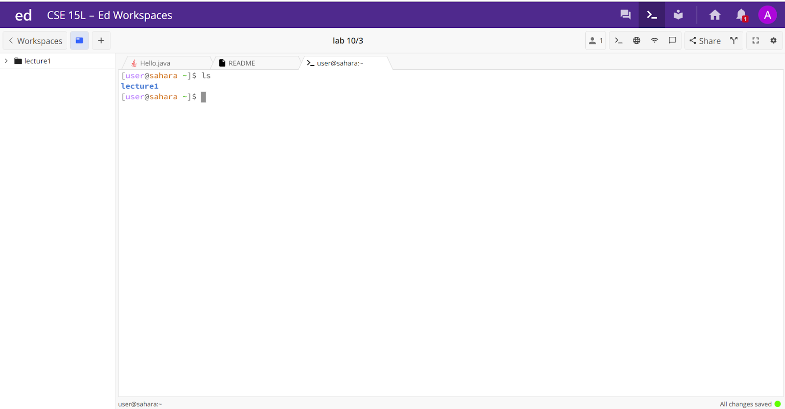
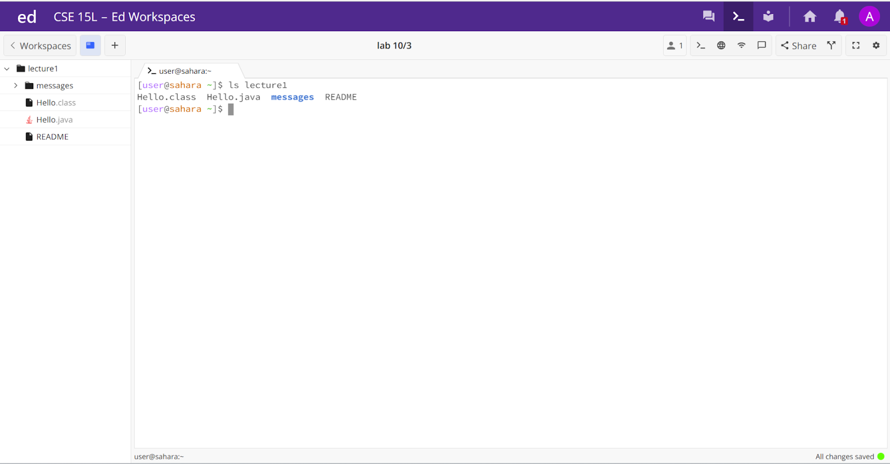
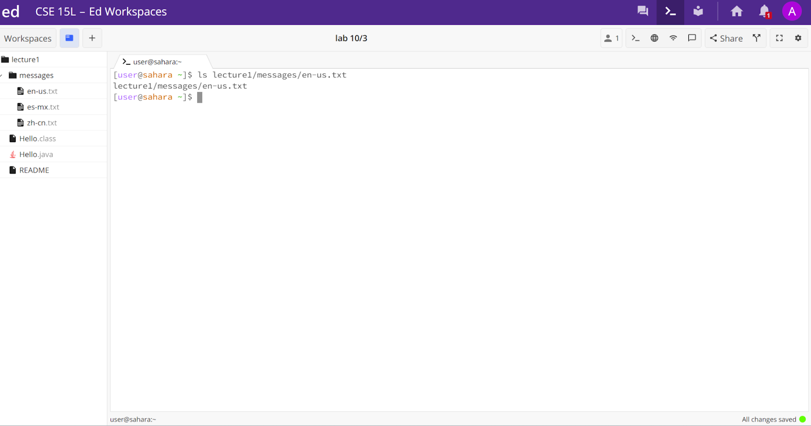

# **Lab Report 1**

The command cd changes the directory, but with no arguments, the working directory remains the same, /home. This output is not an error.

By changing the directory to lecture1, the working directory now becomes lecture1. This output is not an error. 

Changing the directory to a txt file will not work because it is not a directory, but a file. This output is an error because the working directory can not be a file. 

The command cat essentially prints the contents of a file, so without an argument, there is nothing to be printed. This output is not an error.

When cat is given a directory as a path, it just prints that messages is a directory because there is no content to be printed. This output is not an error.

In this case, cat is given a txt file that has content to be printed out, so "Hello World!" is displayed. This output is not an error.

The command ls lists out files and folders given a path, so without a path it doesn't print anything. This is not an error.

Here, ls lists out the files underneath lecture1, and is not an error.

Under the en-us.txt file, there is no other files and folders, so nothing is listed out. This is not an error.

