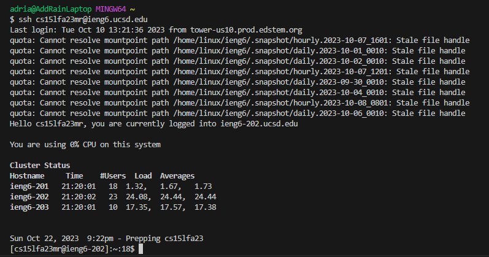

# **Lab Report 2**
## Part 1

The method handleRequest is called in my code. The relevant argument for this method is the URL of the web server where a user can add a path that the method then looks at. The relevant fields are a string named line and an int named num. Num is set to 0 and increments by one whenever a new message is requested to represent a number list with each line displaying the message. In this case, num increments only once and has a value of 1 because only one message was requested. Line is an empty string variable that is concatenated with various factors: num, a ".", the message that the user inputs, and "\n." Line is constantly updated but retains previous data to display every line in the list. In this example, line is updated only once with num = 1, and the message is "Hello." 

Similar to the first example, handleRequest is the only method called. This method is called twice, with its argument the first time being the URL above, https://0-0-0-0-3002-f5323givi9rl9tov606akq9cag.us.edusercontent.com/add-message?s=Hello. The second time it is called, the argument is https://0-0-0-0-3002-f5323givi9rl9tov606akq9cag.us.edusercontent.com/add-message?s=Hello%20123. Num is set to 0 at first, and increments by 1 twice, ending with a value of 2. It is incremented each time a new message is requested. Line begins as an empty string, but is concatenated twice. The first time, num is 1 and the message inputted is "Hello." The second time, num is 2 and the message is "Hello 123." Line retains the data from the first message and just adds the second message into the variable. 
## Part 2

## Part 3
Something I learned in week 2 was how to set up and run a web server. By running two commands, I can start running a web server that can be updated through inputs by a user. If a user changes the path, the server can be updated in various ways. A server might be too full if its port has too many users, so I can change that as well to whatever number I wish. Although the tools I have learned are simple, I find them very interesting because this is something I didn't know how to do before.
