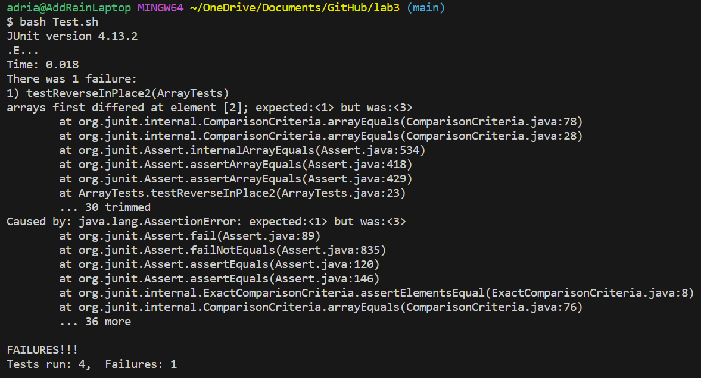

# **Lab Report 3**
## Part 1
Failure Inducing Input:
```
@Test
public void testReverseInPlace2() {
    int[] input1 = {1, 2, 3};
    ArrayExamples.reverseInPlace(input1);
    assertArrayEquals(new int[]{3, 2, 1}, input1);
}
```
Non-failing Input:
```
@Test 
public void testReverseInPlace() {
    int[] input1 = { 3 };
    ArrayExamples.reverseInPlace(input1);
    assertArrayEquals(new int[]{ 3 }, input1);
}
```
Symptom:

<br> Before fix:
```
  static void reverseInPlace(int[] arr) {
    for(int i = 0; i < arr.length; i += 1) {
      arr[i] = arr[arr.length - i - 1];
    }
  }
```
After fix:
```
static void reverseInPlace(int[] arr) {
    int temp;
    for(int i = 0; i < arr.length / 2; i += 1) {
     temp = arr[i];
     arr[i] = arr[arr.length - i - 1];
     arr[arr.length - i - 1] = temp;
    }
  }
```
This fixes the issue because 

