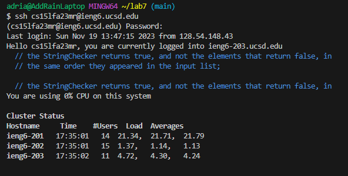
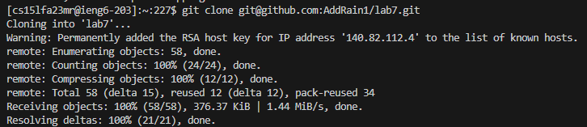
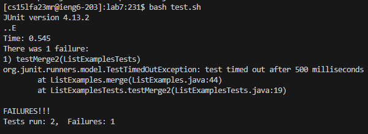
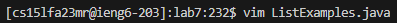
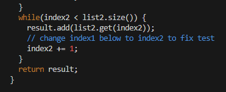
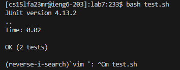
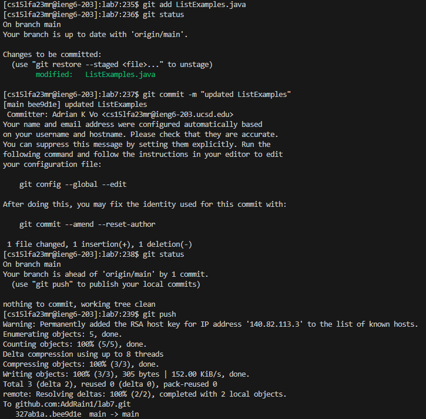

# **Lab Report 4**
## Step 4

 I typed in `ssh cs15lfa23mr@ieng6.ucsd.edu` as well as my password to log onto my remote account on the ieng6 computer. 
## Step 5

 I typed in `git clone git@github.com:AddRain1/lab7.git` to clone my fork from my GitHub account.
## Step 6

 I ran `bash test.sh` to run the tests, which then indicated a failure.
## Step 7

 
 To fix the failing test, I typed `vim ListExamples.java` to get edit its contents. Then I pressed the keys, in order: `43j`, `2w`, `h`, `i`, `<backspace>`, `2`, `<esc>`, `:wq`. '43j' moved my cursor down 43 lines because 'j' is a command that moves the cursor down one line. 'w' moves a cursor one word forward, so I did '2w' to get behind the desired word. However, I went one space too far, so I pressed 'h', which brought my cursor to the left by one space. I pressed 'i' to go into insert mode and then pressed backspace to delete the '1'. I pressed '2' to replace it and then 'esc' to go back into normal mode. From there I typed ':wq' to save and exit the vim editor.
## Step 8

 I ran `bash test.sh` once again to show the tests now all pass.
## Step 9

 To commit and push my change to my GitHub account, I first had to type `git add ListExamples.java` to add that file to my commit. I then typed `git status` just to check that the file is ready to be committed. I committed by typing `git commit -m "updated ListExamples"`. The final step was for me to type `git push` to push these changes into my remote repository. 

