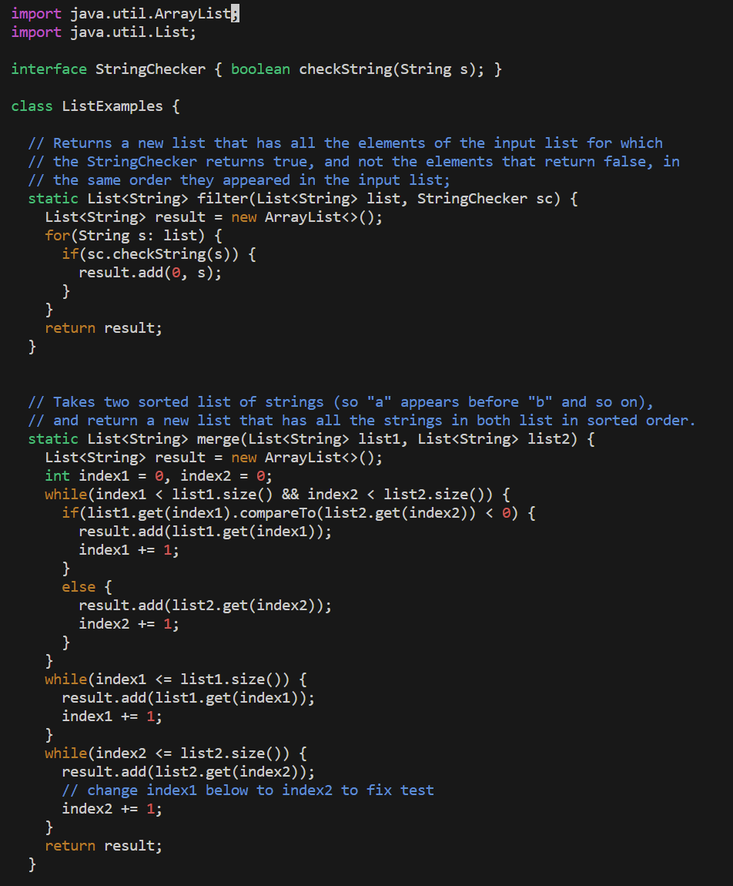
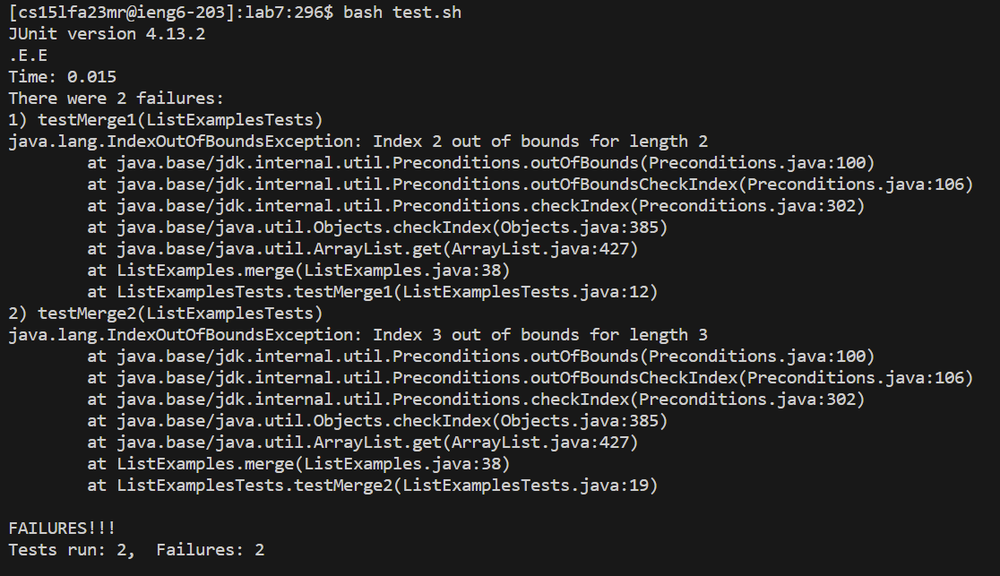
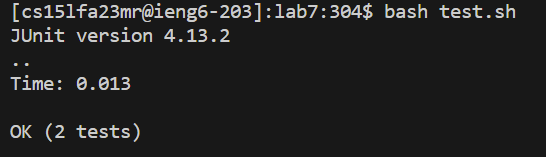

# **Lab Report 5**
## Part 1
### Student Post


I'm having trouble debugging ListExamples.java. My test cases keep failing because of an out of bounds error and I'm not sure why, but I think it might be because my while loop should check for when the index is less than the length of the list - 1.

### TA Response
Hi! Since the error produced is caused by an index out of bounds, the count of your index is incrementing too high. At the bottom of your code, there are two while loops that iterate while the index is less than or equal to the length of the list. Removing the equal sign should fix this.

### After Fix

By removing the equal sign, the while loops iterated one less time and the index did not go out of bounds. Thanks!

### Setup
The correct files and directories can all be accessed by git cloning this URL: git@github.com:AddRain1/lab7.git.
ListExamples.java
```
import java.util.ArrayList;
import java.util.List;

interface StringChecker { boolean checkString(String s); }

class ListExamples {

  // Returns a new list that has all the elements of the input list for which
  // the StringChecker returns true, and not the elements that return false, in
  // the same order they appeared in the input list;
  static List<String> filter(List<String> list, StringChecker sc) {
    List<String> result = new ArrayList<>();
    for(String s: list) {
      if(sc.checkString(s)) {
        result.add(0, s);
      }
    }
    return result;
  }


  // Takes two sorted list of strings (so "a" appears before "b" and so on),
  // and return a new list that has all the strings in both list in sorted order.
  static List<String> merge(List<String> list1, List<String> list2) {
    List<String> result = new ArrayList<>();
    int index1 = 0, index2 = 0;
    while(index1 < list1.size() && index2 < list2.size()) {
      if(list1.get(index1).compareTo(list2.get(index2)) < 0) {
        result.add(list1.get(index1));
        index1 += 1;
      }
      else {
        result.add(list2.get(index2));
        index2 += 1;
      }
    }
    while(index1 <= list1.size()) {
      result.add(list1.get(index1));
      index1 += 1;
    }
    while(index2 <= list2.size()) {
      result.add(list2.get(index2));
      // change index1 below to index2 to fix test
      index2 += 1;
    }
    return result;
  }


}
```
ListExamples.java
```
import static org.junit.Assert.*;
import org.junit.*;
import java.util.*;
import java.util.ArrayList;


public class ListExamplesTests {
	@Test(timeout = 500)
	public void testMerge1() {
    		List<String> l1 = new ArrayList<String>(Arrays.asList("x", "y"));
		List<String> l2 = new ArrayList<String>(Arrays.asList("a", "b"));
		assertArrayEquals(new String[]{ "a", "b", "x", "y"}, ListExamples.merge(l1, l2).toArray());
	}
	
	@Test(timeout = 500)
        public void testMerge2() {
		List<String> l1 = new ArrayList<String>(Arrays.asList("a", "b", "c"));
		List<String> l2 = new ArrayList<String>(Arrays.asList("c", "d", "e"));
		assertArrayEquals(new String[]{ "a", "b", "c", "c", "d", "e" }, ListExamples.merge(l1, l2).toArray());
        }

}
```
test.sh
```
javac -cp .:lib/hamcrest-core-1.3.jar:lib/junit-4.13.2.jar *.java
java -cp .:lib/hamcrest-core-1.3.jar:lib/junit-4.13.2.jar org.junit.runner.JUnitCore ListExamplesTests
```
To trigger the bug, I ran "bash test.sh"
To fix the bug, remove the equal sign in the last two while loops.

## Part 2
Something cool that I didn't know before was how to create and run my own webserver. I thought it was very interesting to be able to edit the path of a url and alter the text produced on my screen.  I also did not know how to compile and run java files. Being able to put these commands into a bash file made it easier and efficient, which I found very interesting as well.  
